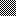

# Nearest neighbor notes

I've long wondered why it seems not to be possible to once again scale down images that have been scaled up to a non-integer factor with nearest-neighbor scaling. Turns out, it's *entirely* possible, and it just happens to be so that most graphical graphics editors do it wrong. “Nearest neighbor” is, as now revealed itself to me, not an algorithm that always produces the same result. It has not one, but *two* parameters: the scale, and the *origin.* The origin is where within each source region destination pixels are sampled/placed.

The reasonable thing to do is to sample in the center of each region. This is guaranteed to be correct when scaling down an image that's been scaled up with nearest neighbor, since your sample will always fall within the correct upscaled pixel in the scaled image. Some (most?) software, however, employs a more naïve method of having the origin in a corner, it appears.

(It's possible that it also depends on the platform's specific floating point rounding behavior, but… let's not get into that. I haven't investigated it, at any rate.)

## Examples

Here's a 16×16 image that I've scaled up using various programs.

## ImageMagick

ImageMagick's nearest-neighbor algorithm has its origin is in the center (rounding up). Love it. That makes ImageMagick suited to scaling screenshots down again.

## Paint.net

Paint.net's nearest-neighbor algorithm has its origin is in the bottom right. Wack.

